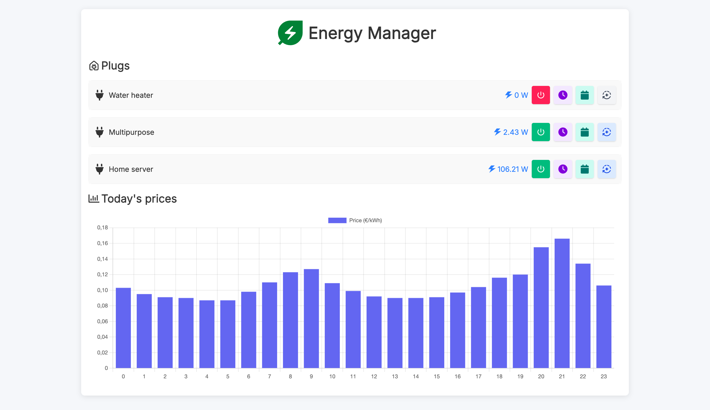
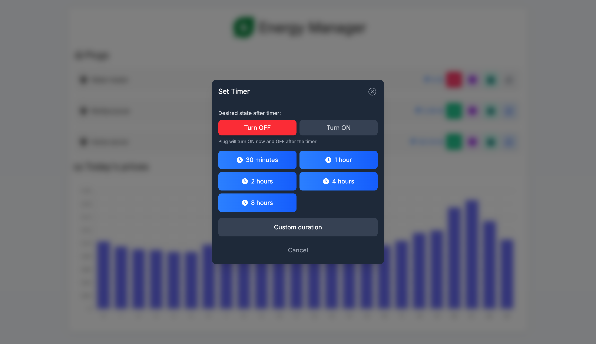
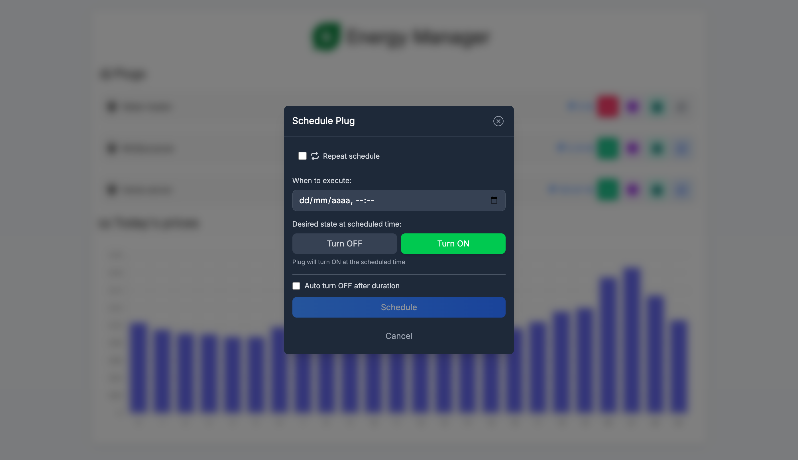

# Energy Manager

An intelligent energy-saving application that schedules Tapo smart plugs based on electricity prices. The system automatically fetches daily electricity prices, calculates optimal runtime schedules, and controls smart plugs via their local API.



## Features

- **Automatic scheduling** - Schedules plugs during cheapest electricity hours based on configurable strategies
- **Manual control** - Turn plugs on/off instantly via the web UI
- **Countdown timers** - Set a timer to turn a plug on/off after a duration
- **Scheduled events** - Schedule plug actions for specific future times
- **Repeating schedules** - Create recurring schedules with flexible frequency patterns
- **Real-time power monitoring** - View current power consumption for each plug
- **Hourly energy usage** - Track energy consumption throughout the day
- **Price chart** - Visualize today's electricity prices by hour
- **Email notifications** - Daily price summary and plug action notifications
- **Multiple scheduling strategies** - Period-based or valley detection algorithms
- **Device profiles** - Optimized scheduling for water heaters, radiators, etc.

### Timer Modal



### Schedule Modal



## Security Disclaimer

This application does not provide built-in authentication. Deploy it in a protected network or behind a reverse proxy that implements authentication (Basic Auth, OAuth2, etc.).

## Prerequisites

- Python 3.9+
- Node.js 18+ & npm
- Tapo account credentials
- SMTP server for email notifications (optional)

## Configuration

Create `config.properties` in your config directory:

```properties
[settings]
provider = omie
timezone = Europe/Madrid

[email]
from_email = Energy Manager <energy@example.com>
to_email = Your Name <you@example.com>

[credentials]
tapo_email = your_tapo_account@example.com
tapo_password = your_tapo_password

# Plug with automatic scheduling (valley detection strategy)
[plug1]
name = Water heater
address = 192.168.1.10
strategy = valley_detection
device_profile = water_heater
runtime_hours = 5
morning_window = 04:00-10:00
evening_window = 16:00-20:00

# Plug with period-based scheduling
[plug2]
name = Radiator
address = 192.168.1.11
strategy = period
period1_start_hour = 0
period1_end_hour = 8
period1_runtime_human = 2h
period2_start_hour = 18
period2_end_hour = 23
period2_runtime_human = 1h

# Manual-only plug (no automatic scheduling)
[plug3]
name = Multipurpose
address = 192.168.1.12
```

### Configuration Options

| Section | Key | Description |
|---------|-----|-------------|
| `[settings]` | `provider` | Price provider (`omie` for Spanish market) |
| `[settings]` | `timezone` | Timezone for scheduling (e.g., `Europe/Madrid`) |
| `[email]` | `from_email` | Sender address for notifications |
| `[email]` | `to_email` | Recipient address for notifications |
| `[credentials]` | `tapo_email` | Tapo account email |
| `[credentials]` | `tapo_password` | Tapo account password |

### Plug Configuration

| Key | Description |
|-----|-------------|
| `name` | Display name for the plug |
| `address` | IP address of the Tapo plug on your LAN |
| `strategy` | Scheduling strategy: `period` or `valley_detection` |
| `device_profile` | For valley_detection: `water_heater`, `radiator`, or `generic` |
| `runtime_hours` | Total hours to run per day (valley_detection) |
| `morning_window` | Morning time window, e.g., `04:00-10:00` (valley_detection) |
| `evening_window` | Evening time window, e.g., `16:00-20:00` (valley_detection) |
| `periodN_start_hour` | Period N start hour 0-23 (period strategy) |
| `periodN_end_hour` | Period N end hour 0-23 (period strategy) |
| `periodN_runtime_human` | Runtime for period N, e.g., `2h` or `30m` (period strategy) |

### Scheduling Strategies

**Period Strategy**: Finds the cheapest hours within each defined time period.

**Valley Detection Strategy**: Automatically detects price valleys and distributes runtime across them. Device profiles optimize behavior:
- `water_heater`: Splits runtime between morning and evening windows
- `radiator`: Distributes runtime across multiple valleys throughout the day
- `generic`: Uses single cheapest valley

## Development

### Quick Start

```bash
# Start both backend and frontend
./dev_start.sh

# Stop services
./dev_stop.sh
```

Access:
- Frontend: http://localhost:5173
- Backend API: http://localhost:8000

### Manual Setup

**Backend:**
```bash
cd backend
python3 -m venv .venv
source .venv/bin/activate
pip install -r requirements.txt
python app.py --reload
```

**Frontend:**
```bash
cd client
npm install
npm run dev
```

## Docker Deployment

The application uses a multi-container setup with a gateway pattern:

```bash
# Start all services
chmod +x run.sh
./run.sh ./backend/config ./backend/data $(id -u) 4000

# Access the app at http://localhost:4000

# Stop services
docker-compose down
```

Parameters for `run.sh`:
1. Config directory path
2. Data directory path
3. User ID (for file permissions)
4. Gateway port (optional, default: 4000)

## API Endpoints

### Plugs
| Method | Endpoint | Description |
|--------|----------|-------------|
| GET | `/api/plugs` | List all plugs with status and schedules |
| GET | `/api/plugs/{address}/energy` | Get hourly energy usage |
| POST | `/api/plugs/{address}/on` | Turn plug on |
| POST | `/api/plugs/{address}/off` | Turn plug off |
| POST | `/api/plugs/{address}/timer` | Set countdown timer |
| POST | `/api/plugs/{address}/toggle_automatic` | Toggle automatic scheduling |

### Schedules
| Method | Endpoint | Description |
|--------|----------|-------------|
| GET | `/api/plugs/{address}/schedules` | Get pending schedules |
| POST | `/api/plugs/{address}/schedule` | Create scheduled event |
| DELETE | `/api/plugs/{address}/schedules/{id}` | Cancel scheduled event |
| DELETE | `/api/plugs/{address}/repeating-schedules/{id}` | Cancel repeating schedule |
| POST | `/api/recalculate_schedules` | Recalculate automatic schedules |

### Other
| Method | Endpoint | Description |
|--------|----------|-------------|
| GET | `/api/prices` | Get today's hourly prices |
| GET | `/api/health` | Health check endpoint |

## Troubleshooting

- **Plugs not responding**: Ensure Tapo devices are on the same LAN and reachable
- **Email not sending**: Check Postfix logs in the container
- **Prices not loading**: Verify the provider is configured correctly and accessible
- **Schedule not executing**: Check backend logs for errors; schedules retry with exponential backoff on failure

## Architecture

- **Gateway** (nginx): Routes traffic to backend and frontend
- **Backend** (FastAPI): REST API, scheduling engine, plug control
- **Frontend** (Vite + React): Web UI with TailwindCSS
- **Postfix**: Internal SMTP relay for notifications

See `AGENTS.md` for detailed architecture documentation.
