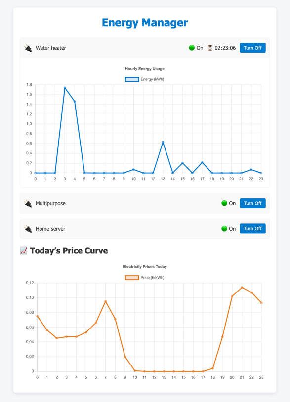

# 🔌 Energy Manager

An intelligent energy‐saving app that schedules your Tapo smart plugs based on electricity prices 📈.  
Includes a FastAPI backend and a Vite+React frontend with live plug control and usage charts.



## 🚀 Features

- ✅ Auto‐fetch and parse daily electricity prices
- ⏱️ Schedule N configurable periods per plug for cheapest runtime
- 📧 Daily email report with price chart (PNG)
- 🌐 REST API to list plugs, toggle on/off, view active countdown
- 📊 React UI with interactive plug details and hourly energy usage chart

## 🛠️ Prerequisites

- Python 3.9+
- Node.js 18+ & npm
- Tapo account credentials & local SMTP server.

## ⚙️ Configuration

Create `config.properties` in the project root:

```properties
[settings]
provider = your_energy_provider

[email]
from_email = your_from_email@example.com
to_email   = your_to_email@example.com

[credentials]
tapo_email    = your_tapo_account@example.com
tapo_password = your_tapo_password

[plug1]
enabled                   = true
name                      = Water heater
address                   = 192.168.1.10
period1_start_hour        = 0
period1_end_hour          = 6
period1_runtime_human     = 2h
period2_start_hour        = 18
period2_end_hour          = 23
period2_runtime_human     = 1h

[plug2]
enabled                   = true
name                      = Multipurpose
address                   = 192.168.1.11

[plug3]
enabled                   = true
name                      = Home server
address                   = 192.168.1.12
```

## 🏗️ Development

1. Clone & enter project dir
   ```bash
   git clone https://github.com/yourusername/energy-manager.git
   cd energy-manager
   ```

2. Python backend
   ```bash
   python3 -m venv .venv
   source .venv/bin/activate
   pip install -r requirements.txt
   uvicorn api:app --reload
   ```
    - API runs on http://localhost:8000
    - Static chart served at `/api/static/prices_chart.png`

3. React frontend
   ```bash
   cd frontend
   npm install
   npm run dev
   ```
    - Frontend runs on http://localhost:5173
    - Proxies `/api` → http://localhost:8000

## 🚀 Production

1. Build frontend
   ```bash
   cd frontend
   npm run build
   ```
    - Output in `frontend/dist`

2. Serve static assets and API under one domain
    - Copy `frontend/dist` into a static directory
    - Mount via FastAPI or use Nginx to serve `/` from `dist` and `/api` to Uvicorn

3. Run Uvicorn
   ```bash
   uvicorn api:app --host 0.0.0.0 --port 8000
   ```

## 🔧 Troubleshooting

- Ensure Tapo IPs are reachable on your LAN
- Check SMTP logs for email delivery
- Increase logging level in `energy_manager.py` if needed

Feel free to ⭐ the repo!
